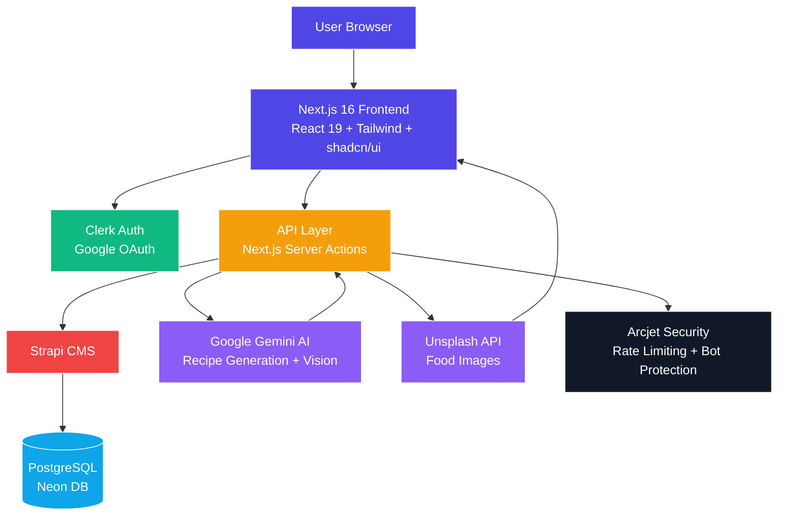

# 🍳 Servd — AI Recipe Platform

Servd is a **full-stack AI-powered recipe platform** that helps users turn available ingredients into personalized recipes using generative AI. It combines modern web technologies, AI integration, and a scalable backend to deliver a seamless cooking experience.

---

## ✨ Features

### 📸 AI Pantry Scanner
Upload an image of your fridge or pantry, and AI automatically detects ingredients.

### 🍳 Smart Recipe Generation
Generate step-by-step recipes based on available ingredients, dietary preferences, and cooking time.

### 📄 PDF Export
Download professionally formatted recipes as PDFs for easy sharing and offline use.

### 🔖 Personal Cookbook
Save, organize, and manage your favorite recipes in one place.

### 💎 Pro Tier Features
- Nutrition analysis
- Chef-level cooking tips
- Ingredient substitutions
- Unlimited AI scans

### 📱 Fully Responsive UI
Optimized for mobile, tablet, and desktop devices.

---

## 🛠️ Tech Stack

### Frontend
- Next.js 16 (App Router)
- React 19
- Tailwind CSS
- shadcn/ui

### Backend / CMS
- Strapi (Headless CMS)
- PostgreSQL (Neon DB - Serverless)

### Authentication & Security
- Clerk Authentication (Google OAuth)
- Arcjet (Bot protection & rate limiting)

### AI & APIs
- Google Gemini AI (Recipe generation & image recognition)
- Unsplash API (Food images)

### Utilities
- React-PDF (Recipe export system)

## System Architecture

## 🚀 Future Enhancements

### 🧠 Advanced AI Capabilities
- Multi-image understanding (scan full kitchen, not just one image)
- Voice-based cooking assistant (real-time step guidance while cooking)
- Context-aware recipes (adjust based on time of day, region, or user habits)
- Fine-tuning with user feedback to improve recipe accuracy over time  
- Built on Google Gemini AI capabilities  

### 🥗 Nutrition & Health Intelligence
- Macro & micronutrient breakdown per recipe  
- AI-based diet planning (keto, vegan, diabetic-friendly)  
- Integration with fitness apps like Google Fit or Apple Health  
- Allergy detection and safety warnings  

